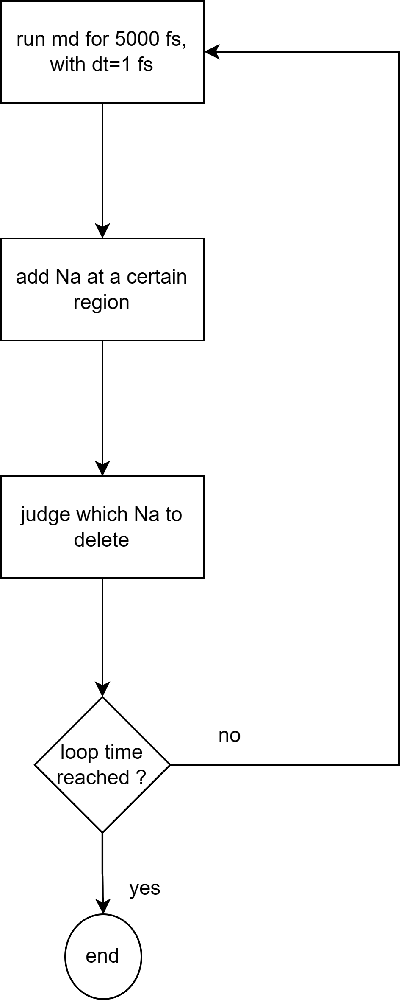

# introduction

This is a template for LAMMPS, designed for MD+GCMC simulations. The MD process is segmented, with the number of segments being determined by `mainloop_time`. Each segment can be set to a specific number of steps (denoted as `run_time_at_each_loop`), such as 5000 steps. Upon completing these steps, the system undergoes GCMC simulation, which consists of two phases: adding and removing atoms. The rules for each phase are specified in `scripts/add_rules.py` and `scripts/del_rules.py`, respectively. In `add_rules.py`, it is necessary to output `elelpj_cors`, which represents the elements and their coordinates. Note that the elements follow the sequence number in lpj-trj, hence `elelpj`. In `del_rules.py`, the primary task is to determine, based on rules, which sequence number should be deleted. Modifications should also be made to the last few lines of `script/adddel_conditions_2_adddel_files.py`.

`in.part1.lammps` contains basic information related to loops. `in.part2.lammps` includes fundamental details about the force field, such as the elements involved. `in.part3.lammps` involves the criteria for adding and removing atoms, as well as references to scripts, etc.

# usage

cat in.part1.lammps  in.part2.lammps  in.part3.lammps  > in.lammps
prepare datafile graph.pb for md.

edit add_rules.py  del_rules.py to set add and del rules. One can also use the template in scripts/rules_template/ 

# An example

This example simulates the intercalation and deintercalation process of Na in C within an amorphous VOx matrix. The simulation is conducted in increments of 5000 steps. At the end of every 5000-step interval, 7 Na atoms are added to the VOx region. Subsequently, these atoms are removed if they are below a certain chemical potential threshold.

